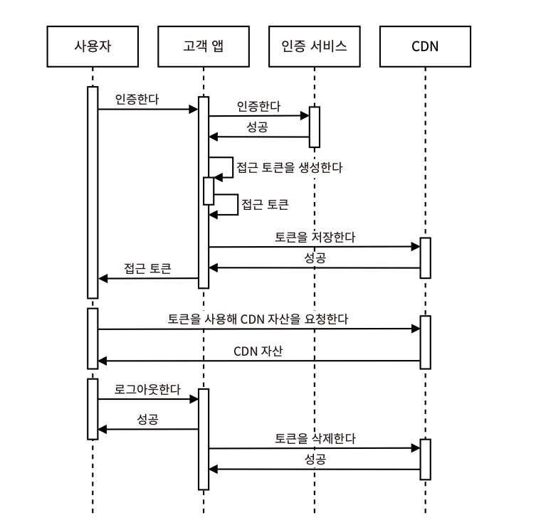
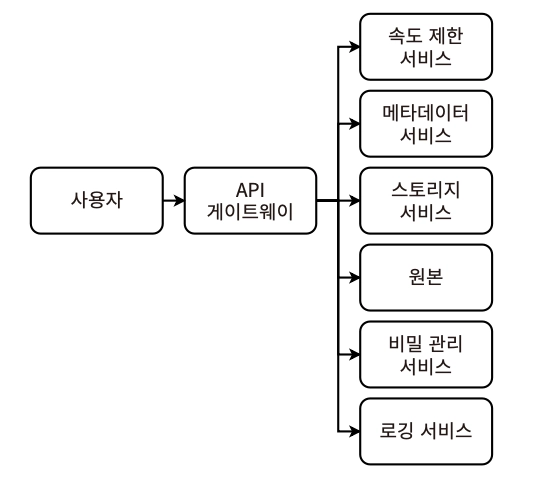
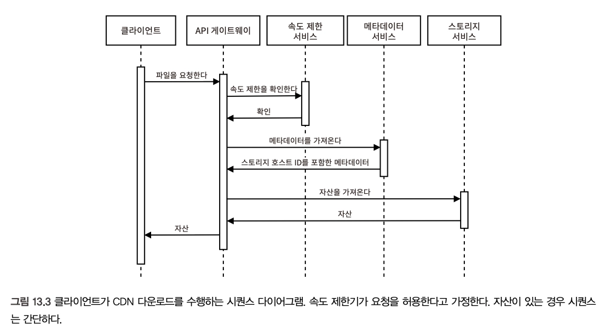
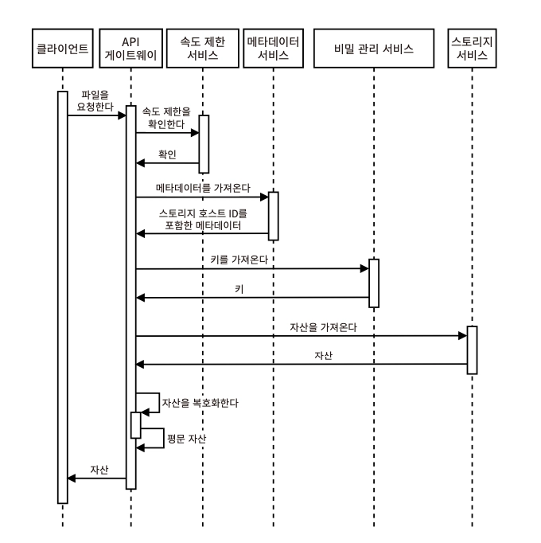
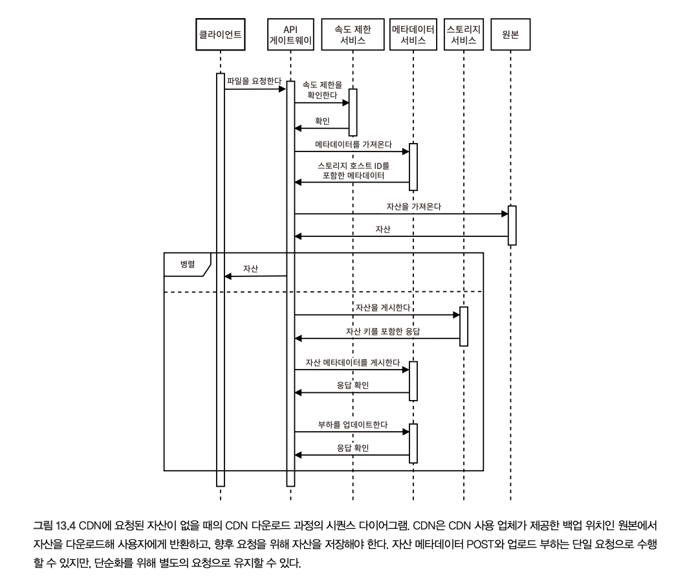

# 13장. 콘텐츠 배포 네트워크 설계하기

> CDN(콘텐츠 배포 네트워크) - 비용 효율적이고 지리적으로 분산된 파일 저장 서비스
> 
- 여러 데이터 센터에 걸쳐 파일을 복제해 지리저으로 분산된 많은 사용자에게 정적 콘텐츠를 빠르게 제공하도록 설계
- 각 사용자에게 가장 빠르게 서비스할 수 있는 데이터 센터에서 서비스 제공
- 특정 데이터 센터가 사용 불가한 경우, 다른 데이터 센터에서 제공 가능한 내결함성

## CDN의 장단점

### 장점

- 낮은 지연 시간 - SEO 개선 등의 이점
- 확장성 - 서드파티 제공업체가 대신 관리
- 낮은 단위 비용 - 사용자 규모, 부하가 커질수록 단위 비용이 낮아짐
- 높은 처리량 - 자사 서비스에 추가 호스트 제공
- 높은 가용성 - 호스트 실패/과부하 시, 다른 데이터 센터로 트래픽 리디렉션&밸런싱

### 단점

- 다른 서비스를 포함하는 것의 추가 복잡성 → 추가적인 DNS 조회, 실패 지점
- 트래픽이 적을수록 높은 단위 비용
- 다른 CDN으로 마이그레이션 하는 경우의 비용이 큼
    1. CDN이 사용자가 꽤 많이 확보된 지역을 커버하지 않는 경우
    2. CDN 회사의 폐업
    3. SLA 불이행, 고객 지원 열악, 사고를 유발한 경우
- 일부 국가/조직에서 특정 CDN의 IP주소를 차단했을 수 있음
- 보안, 프라이버시 이슈
    - 암복호화 도입 시의 비용은 추가로 수반됨
- JS 라이브러리 악성 코드 삽입
- CDN 회사에서 기술적 문제 해결, SLA 준수 등을 담당하므로 통제 불가
- 특정 사용 사례를 충분히 사용자 정의할 수 없어 예상치 못한 문제 발생 가능

### 이미지 CDN 사용 시의 예상치 못한 문제 사례

- CDN은 GET 요청의 User-Agent 헤더를 읽어 요청이 웹 브라우저에서 온 것인지 확인 → 업로드된 PND/JPEG 형식을 WebP 형식으로 반환
- 원본 형식으로 이미지를 반환받고자 하는 경우?
    1. 웹 애플리케이션에서 User-Agent 헤더 재정의
        - e.g. Chrome - Firefox에 한해 재정의 허용 https://bugs.chromium.org/p/chromium/issues/detail?id=571722, https://bugzilla.mozilla.org/show_bug.cgi?id=1188932
    2. 특정 서비스에는 WebP 이미지 제공 & 다른 서비스에는 원본 형식으로 이미지를 제공하도록 CDN 구성
        - 주로 개별 서비스 단위보다 전역으로 형식을 제공하는 수준까지만 제공 (인프라 팀의 관리 복잡도가 높기 떄문)
    3. 요청을 백엔드 서비스를 통해 라우팅
        - API 엔드포인트를 노출해야 함
        - CDN의 대부분의 이점을 무효화하는 것 - 추가적인 지연 시간, 문서화와 같은 유지보수 부담, 백엔드 호스트 자체가 지리적으로 사용자와 멀리 떨어져 있을 수 있음

## 요구사항

### 기능

- 권한이 있는 사용자
    - 디렉터리 생성
    - 파일 업로드 *10GB 크기 제한
    - 파일 다운로드

**CDN을 제공하는 회사의 관점이므로, 콘텐츠 관리에 대해서는 다루지 않음*

### 비기능

- 확장성 - PB 규모의 저장 용량, 하루 TB 수준의 다운로드 용량 지원
- 고가용성 - 99.99/99.999%의 가동 시간
- 고성능 - 요청자에게 가장 빠르게 제공가능한 데이터 센터에서 다운로드 (업로드 성능은 덜 중요)
- 내구성 - 파일 손상 X
- 보안과 프라이버시 - 데이터 센터 외부의 요청을 처리하고 파일 전송하므로 **권한이 있는 사용자인지** 검증 필요

## CDN 인증과 권한 부여

- Hotlinking 방지
    - 기타 웹사이트의 리소스(주로 이미지)를 허가 없이 직접 링크해 사용하는 행위
    - CDN 자산에 사이트/서비스의 허가 없이 접근하는 것을 방지해야 함
- 인증/인가 구현
    1. 쿠키 기반 인증
    2. 토큰 기반 인증 - 비교적 적은 메모리 사용, 보안 전문성이 더 높은 서드파티 이용 가능, 특정 IP/사용자 계정 단위 제한과 같이 세밀한 접근 제어 가능
- 권한 부여 절차
    
    > **CDN 사용 업체 = CDN에 자산을 업로드한 후, 사용자/클라이언트를 CDN으로 유도하는 웹사이트/서비스**
    > 
    
    
    
    1. CDN은 각 사용 업체에 secret key 발급, access token을 생성하는 SDK/라이브러리 제공
    2. 사용자 → CDN 사용 업체 앱에 인증 요청
    3. CDN 사용 업체 앱이 SDK를 사용해 access token 생성
        1. Secret Key
        2. CDN URL
        3. Expiry
        4. Referrer — **클라이언트/사용자가 CDN에 HTTP 요청을 할 때는 CDN 사용 업체의 URL을 Referrer HTTP 헤더로 포함해야 한다**
        5. Allowed IPs
        6. Allowed Countries/Regions (블랙리스트나 화이트리스트 포함 — IP로 커버되지만 편의성을 위해 이 항목을 그대로 유지하기도 함)
    4. 고객 앱에서 토큰 저장 후, 이 토큰을 사용자에게 반환 (+ 암호화된 형태로 저장)
    5. 고객 앱이 사용자에게 CDN URL을 제공할 때마다, 사용자가 GET 요청을 할 때마다 access token 서명을 거쳐야 함 (→ 이때 CDN에서 검증 및 권한 부여 수행) = **URL Signing**
        
        https://cdnsun.com/knowledgebase/cdn-static/setting-a-url-signing-protect-your-cdn-content
        
    6. 사용자 로그아웃 시 고객 앱은 사용자의 토큰을 파기 (비동기 or 동기) → 로그인 시 재생성
        
        **비동기 시 토큰이 삭제되지 않는 것을 방지하기 위한 수단*
        
        1. 일부 토큰이 파기되지 않도록 허용
        2. 이벤트 기반 접근법 (kafka queue)
        3. 토큰 삭제를 동기식/블로킹 방식으로 구현 → 토큰 삭제 실패 시 로그아웃 요청 재시도하게끔 강제
- *Reference*
    - https://learn.microsoft.com/en-us/previous-versions/azure/cdn/cdn-token-auth
    - https://blog.cdnsun.com/protecting-cdn-content-with-token-authentication-and-url-signing/

### 키 교체 (Key Rotation)

- 고객의 키를 주기적으로 변경하여 해커가 중간에 훔치는 것을 대비
- 새 키를 모든 시스템에 전파하는 동안 이전 키, 새 키를 모두 지원
- 이전 키의 만료시간을 짧게 설정해 가능한 빠르게 전환하도록 보장

## 상위 수준 아키텍처

> ***API Gateway - Metadata - Storage/DB***
> 

- 모든 사용자 요청이 API gateway를 통함으로써 메타데이터 서비스의 정보를 활용해 ‘**모든 사용자가 어떤 저장소 서비스 호스트에서 읽거나 쓸지 결정**’할 수 있게 한다
    - 메타데이터 서비스 - 저장소 서비스 호스트, 파일 디렉터리 정보 저장
- 리소스가 암호화된 경우, secret management 서비스를 통해 암호화 키를 관리하고, 이를 메타데이터 서비스에 기록하여 사용한다
- 작업은 다음과 같이 일반화할 수 있다
    1. 읽기 = 다운로드
    2. 쓰기 = 디렉터리 생성, 업로드, 파일 삭제
- 초기 설계 시, 모든 파일을 모든 데이터 센터에 복제해두고 시작해야 시스템 복잡도를 낮출 수 있음
    - 그렇지 않을 경우, 데이터 센터에 배치된 파일 트래킹, 데이터 센터 간 최적의 파일 분배를 사용자 쿼리 기반으로 결정하는 등의 시스템이 추가로 필요함

## 저장소 서비스

> **파일을 포함하는 호스트/노드의 클러스터**
> 
- 대용량 파일 저장 시 데이터베이스를 사용해서는 안 되며, 호스트의 파일 시스템에 저장해야 한다
- 파일은 어려 호스트에 할당하여 가용성과 내구성을 확보해야 한다
- 호스트 관리자는 클러스터의 외부 또는 내부에 위치해 있을 수 있다
        
    1. 클러스터 내부 - 노드를 직접 관리
        - 주키퍼 - 리더 선출, 파일-리더-팔로워 간의 매핑 유지 담당
        - 정교한 구성 요소를 필요로 함
    2. 클러스터 외부 - 작은 독립 노드 클러스터를 관리하며, 각각의 클러스터는 자체적으로 관리
        - 관리 대상 : 여러 데이터 센터에 분산된 3개 이상의 노드로 구성된 클러스터
        - 메타데이터 서비스에 파일을 저장해두거나 저장될 클러스터를 식별해 무작워로 파일을 읽거나 씀
        - 리더 선출 X
        - 파일-클러스터 매핑 관리

## 일반적인 작업

[기본 흐름]

1. 클라이언트 → CDN 서비스의 도메인으로 요청
2. GeoDNS → 가장 가까운 호스트의 IP주소 할당
3. 로드 밸런서 → API 게이트웨이 호스트로 요청 전달 
4. API 게이트웨이 → 파일 캐싱 등 다양한 작업 수행

### 읽기: 다운로드

- 요청을 처리할 저장소 호스트를 선택한다
- 메타데이터 서비스에서 정보를 제공하여 이 선택 과정을 지원
    - 호스트의 현재 부하를 추적 (파일 크기 힙으로 산정 가능)
    - 파일 다운로드 소요 시간을 예측
    - 동일한 파일명 구분 → 주로 MD5/SHA 해시 사용
    - 파일 소유권, 접근 제어
    - 호스트 상태
- API 게이트웨이의 파일 다운로드 과정
    
    
    
    1. Rate Limit 서비스를 통해 클라이언트 요청 허용 여부 판단
    2. 메타데이터 서비스 쿼리 → 해당 리소스를 가진 저장소 서비스 호스트 조회
    3. 해당 저장소 호스트로 리소스를 스트리밍
    4. 저장소 호스트 부하 증가로 메타데이터 서비스 업데이트 (비동기 수행 고려)
        - 업데이트 도중 장애 발생 시, 허용된 양보다 더 많은 양으로 CDN을 사용할 수 있음
        - CDN에서 리소스가 삭제되었을 수 있음 (보존기간 만료, 저장공간 부족 등의 이유)
            - → 백업된 원본에서 다운로드해야 함
            - 저장 프로세스와 클라이언트에 리소스를 반환하는 작업을 병렬로 처리하여 지연 시간을 최소화할 수 있다
            
            
- 저장 시 암호화가 적용된 다운로드 과정
    
    
    
    - 비밀 관리 서비스에 암호화 키 저장 & 저장소 서비스에서 암복호화 수행
    - 리소스가 큰 경우, 여러 블록으로 저장되며 각각 복호화해야 함
- CDN이 보유하지 않은 암호화된 자산을 가져오는 요청이 있는 경우
    
    
    
    - API 게이트웨이에서 임의의 암호화 키를 생성 → 리소스 암호화 → 저장소 서비스에 write & 암호화 키를 비밀 관리 서비스에 write (병렬)

### 쓰기: 디렉터리 생성, 파일 업로드, 파일 삭제

- 파일은 ID로 식별되며, 동일한 내용이나 이름의 파일은 서로 다른 것으로 간주된다
- 동일한 파일을 여러 번 저장하지 않고 저장공간을 절약하기 위해서, 소유자 그룹에 대한 관리 레이어가 추가되는데 이는 오히려 과도한 설계로 이어질 수 있다
    - CDN의 저장공간이 커짐에 따라 파일 중복 제거로 절약할 수 있는 비용이 추가 복잡성을 감수할 정도인지 논의해볼 필요가 있다
- 크기가 GB~TB 수준인 파일 업로드, 다운로드 과정에서 중간에 실패한다면?
    - 체크포인팅이나 벌크헤드와 같은 프로세스로 파일을 chunking 하는 것이 효율적이다
    - 클라리언트는 완료되지 않은 chunk부터 이어서 진행 가능 ⇒ ***Multipart Upload***
    - multipart upload를 지원하기 위한 프로토콜 설계
        - 청크 업로드 = 독립 파일 업로드처럼 다룸
        - chunk size = 128MB로 고정
        1. 청크 업로드 시작 시, 클라이언트는 메타데이터를 포함해 메시지 전송
        2. 메타데이터 서비스에서 청크의 업로드 진행상황을 추적할 수 있게끔 기록 → 완료 여부를 보고 재개할 지점을 판단하게 함
        3. 업로드가 중단될 경우, 청크가 저장소 호스트의 공간을 낭비하게 되므로 이를 주기적으로 삭제하는 cron job이나 배치 ETL을 구현할 수 있음
    
    +) 추가 고려 기능
    
    - 클라이언트가 chunk size 선택 가능
    - 파일 업로드와 복제를 병렬로 진행 ⇒ CDN 전체에서 더 빠르게 다운받을 수 있도록 보장 (고성능을 요구할 경우 고려)
    - 클라이언트가 첫 번째 청크를 다운받는 시점에 즉시 미디어 파일 재생 지원
    - 단일 리더 접근 방식 / 튜플을 포함한 다중 리더 접근 방식
    - 모든 데이터 센터에서 업로드 전후로 파일의 lock 획득 및 해제
- **모든 데이터 센터에서 파일의 사본을 포함할 필요는 없다**
    - 특정 파일은 주로 특정 지역에서 사용되므로
    - 복제는 내결함성이 주된 목적임
    - 특정 파일의 조합이 필요한 경우, CDN이 아닌 애플리케이션 레벨에서 이를 처리하도록 할 수 있다
- **여러 데이터 센터로 파일을 분산하고 수요를 충족하기 위해 주기적으로 파일을 복제하고 호스트를 재조정하는 배치 ETL을 수행한다**
    - 로깅 서비스에서 이전 기간의 파일 다운로드 로그 조회 → 파일 요청 수 확인 → 각 파일 저장 호스트 수 조정
    - 각 노드에 추가/삭제해야 할 파일 맵을 만들어 shuffling 수행
                
        !스토리지 서비스가 응답 토픽에 이벤트를 생성해 메타데이터 서비스에 파일 쓰기가 성공적으로 완료되었음을 알린다는 차이가 있음
        
        스토리지 서비스가 응답 토픽에 이벤트를 생성해 메타데이터 서비스에 파일 쓰기가 성공적으로 완료되었음을 알린다는 차이가 있음
        
        - 관리자에 의존해 자체 노드/호스트 내 일관성 보장 가능
        - 메타데이터의 업데이트는 새 위치에 성공적으로 파일이 기록된 성공 응답을 받았을 때만 이루어져야 함
        - https://stackoverflow.com/questions/41737770/how-to-deploy-zookeeper-across-multiple-data-centers-and-failover?__cf_chl_f_tk=w5lSyKetiXSWwKNpwHYA5zQr410Uz.08I5_65mK5oDc-1782881504-1.0.1.1-XvAa9lPzNX8aYxzdmkbA8vD1SBXox1dG_Tp6iNGugys
        - https://serverfault.com/questions/831790/how-to-manage-failover-in-zookeeper-across-datacenters-using-observers?__cf_chl_f_tk=DcqC.VS7pP61AlgPZbDhRWhf05hBWU30mvq5Qdzh3xI-1782881530-1.0.1.1-4gj37F6oFX5PQAiPXMZPJ6xm7mlSMPbe68vFx2wdv_c
        
        ****suffling이란? 특정 위치에서 다른 위치로 파일을 이동하는 것**
        — 과적합 방지와 모델의 일반화 능력을 향상시키기 위해 학습 데이터의 순서를 무작위로 섞는 기법*
        

## 캐시 무효화

파일에 fingerprint를 남기는 방식으로 캐시 무효화를 구현할 수 있으며, 예상 트래픽에 따라 다양한 캐싱 전략/모니터링 시스템을 논의해볼 수 있다.

## 로깅, 모니터링, 경보

- 업로더가 파이의 업로드 진행 중 완료나 실패 상태 추적
- CDN miss 기록
- FE에서의 파일 요청 속도 기록
- 비정상적이거나 악의적인 활동 모니터링
