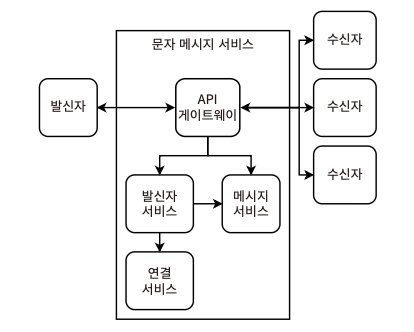
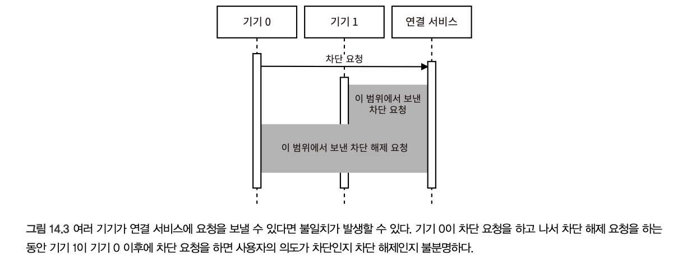
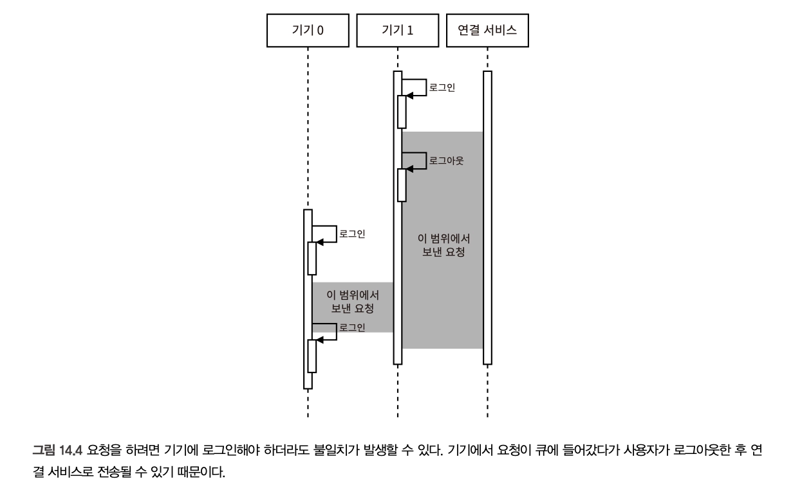
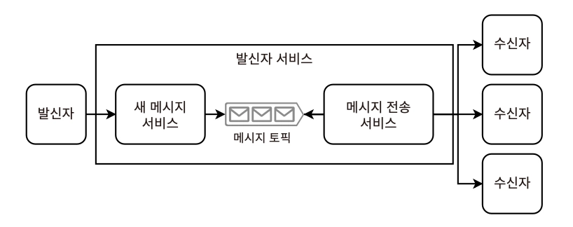
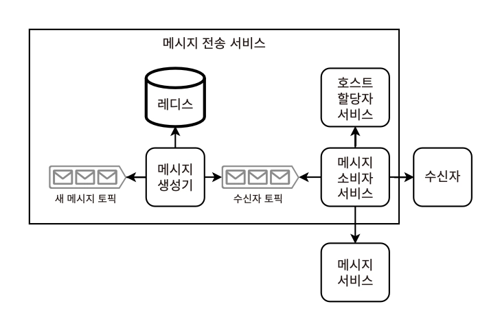
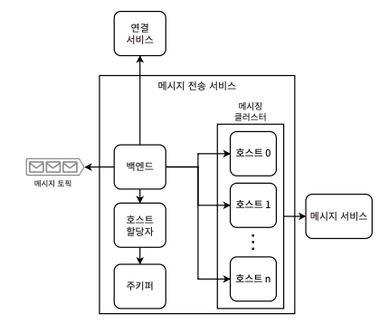

# 14장. 문자 메시징 앱 설계

> 문자 메시징 앱 - 10만 명의 사용자가 서로 몇 초 내에 메시지를 주고받을 수 있는 시스템

- **_exactly-once_**
- 메시지 무손실
- **성능과 오프라인 기능을 극대화**하기 위한 설계 논의

## 요구사항

### 기능

- 실시간, 결과적 일관성 → 2가지를 모두 고려
- 사용자 규모 : 2~1,000명
- 문자 제한 : 1000 UTF-8 문자. 문자당 최대 32bit, 메시지 크기는 최대 4KB
- 알림 구현 : 플랫폼별 알림 라이브러리 활용
- 전송 확인, 읽음 확인 표시
- Read/Write : 메시지 기록, 최대 10MB의 히스토리 조회 및 검색
- 메시지 본문 비공개 (메시지 전송 로그 등의 세부 항목별 노출 여부는 논의 진행)
- 오류 이벤트 로깅 (로그 내용은 end-to-end 암호화 적용)
- 고려하지 않는 것
  - 사용자 온보딩
  - 동일 사용자 그룹에 여러 채팅방/채널 매핑
  - 템플릿 메시지 기능 (→ 클라이언트 사이드에서 모두 해결 가능)
  - 연결된 사용자의 온/오프라인 상태 조회
  - 음성 메시지, 사진, 동영상 등의 미디어 전송

### 비기능

- 확장성 : 동시 사용자 10만 명 → 쓰기 속도 400MB/분으로 추정
  - 최대 1000개의 연결
  - 최대 1000명의 수신자에 메시지 전송 지원
  - 각 수신자 당 최대 5개 기기 지원
- 고가용성 : 99.99%
- 고성능 : P99 메시지 전송 시간 10s
- 보안과 프라이버시 : 사용자 인증 필요. 메시지 비공개
- 일관성 : 메시지의 엄격한 순서 필요X

## 초기 구상

| **구분**           | **메시징 앱**                   | **알림/경보 서비스**                            |
| ------------------ | ------------------------------- | ----------------------------------------------- |
| **우선순위**       | 모든 메시지가 동일한 중요도     | 이벤트별 우선순위 지원 (긴급/일반 등)           |
| **전송 채널**      | 하나의 서비스·채널 내 전달      | 이메일, SMS, 푸시, 전화, 앱 내 알림 등 멀티채널 |
| **트리거 방식**    | 사용자의 수동 요청              | 수동, 이벤트 기반, 스케줄(주기 실행) 모두 가능  |
| **템플릿**         | 거의 사용하지 않음              | 템플릿 생성 및 관리 기능 제공                   |
| **시스템 복잡도**  | E2E 암호화로 서버 역할이 단순   | 템플릿, 채널 관리 등으로 추상화 계층이 많음     |
| **재전송**         | 과거 메시지 조회 및 재수신 가능 | 대부분 일회성 전송                              |
| **전송/읽음 확인** | 핵심 기능 (Delivered, Read)     | 채널 특성상 읽음 확인이 어려운 경우가 많음      |

- 메시징 앱 : **사람 ↔ 사람의 대화**에 초점
  - 상태 관리(읽음, 재조회)가 중요
  - 메시지 자체가 핵심 데이터
- **알림/경보 서비스** : **이벤트 → 사용자 알림**에 초점
  - 우선순위, 멀티채널, 대량 전송이 중요
  - 이벤트 전달이 핵심 목적

> _다른 유사한 요구사항을 가진 시스템의 설계 구성 요소와 식별하여 차이점을 이용해 설계의 복잡성을 추가/제거해나가는 것도 좋은 방법이다_

## 초기 고수준 설계



1. 앱은 수신자의 공개 키로 메시지를 암호화
   - 앱에서 각 수신자의 메타데이터에 이름, 공개 키 정보 저장
   - 수신자가 2명 이상일 경우를 고려해 **각 수신자**의 공개 키로 암호화해야 함
2. 앱 → 메시징 서비스에 메시지 전달 요청
3. 메시징 서비스 → 수신자에게 메시지 전송
   - 메시징 서비스는 각 수신자와의 웹소켓 연결 유지
   - 많은 발신자가 짧은 시간 내 메시지를 보내는 예측 불가능한 트래픽 급증을 처리해야 함
4. 수신자 → 발신자에게 전송 확인, 읽음 확인 메시지 전송

### 서비스 구성

- 발신자 서비스
  - 메시지를 받아 즉시 수신자에 전달
  - 메시지를 메시지 서비스에 기록
- 메시지 서비스
  - 발신자 - 보낸 메시지 요청
  - 수신자 - 받은 메시지, 받지 않은 메시지 요청
- 연결 서비스
  - 사용자의 활성/차단된 연결을 저장 및 검색
  - 연락처 목록 관리
  - 이름, 아바타, 공개 키 등의 연결 메타데이터 관리

## 연결 서비스

- API 목록
  | **API** | **역할** |
  | -------------------------------------------------------------- | --------------------- |
  | **GET** `/connection/user/{userId}` | 연결 목록 조회 |
  | **POST** `/connection/user/{userId}/recipient/{recipientId}` | 연결 요청 |
  | **PUT** `/request/{accept}` | 연결 요청 수락 / 거부 |
  | **PUT** `/block/{block}` | 연결 차단 / 차단 해제 |
  | **DELETE** `/connection/user/{userId}/recipient/{recipientId}` | 연결 삭제 |
  이 정도면 REST API 설계 의도만 한눈에 파악할 수 있습니다.
- 사용자의 연결(accept/block)은 사용자 기기나 브라우저 쿠키, 로컬스토리지 등에 저장되어야 한다
  - 기기 간 동기화 및 데이터 백업을 연결 서비스에서 담당
- 쓰기 트래픽 적고, 데이터 규모도 크지 않음 ⇒ 공유 SQL 서비스 이용
- 발신자 차단은 클라이언트(수신자, 발신자 기기), 서버 모든 계층에서 모두 구현한다
  - 발신자 앱 차단 → 문자 메시지 서비스 차단 → 수신자 앱 차단
  - 서버로의 트래픽을 줄이기 위해 차단된 수신자 연결은 사용자 기기에 저장한다
  - 클라이언트가 발신자를 차단했다는 사실을 기록하여 해당 요청이 서버에서 실패한 경우에도 유실되지 않도록 해야 한다
    - 클라이언트 - 차단된 발신자 메시지 숨김, 새 메시지 알림 미표시 등 구현, 기기의 DLQ로 전송 등 시스템 일부가 실패하더라도 성능 저하 수준에서 기능 제한을 유지할 수 있음
    - 연결 서비스 - 어떤 기기가 서비스와 연결을 동기화했는지 추적 가능 → 차단 수신자가 존재하는지 여부로 버그, 악의적인 활동을 판별 가능
  - 앱 해킹을 방지하기 위한 가장 안전한 방법은 암호화 키를 서버 사이드에 저장하는 것이다 ⇒ 차단된 수신자 목록 데이터를 발신자 기기에 저장하지 못하게 막을 수 있음 (무조건 서버 통신)
- 일관성 문제
  1. 여러 기기에서 동일한 차단/차단 해제 요청을 보낸 경우, 일부 성능 저하에 의해 불일치가 발생하는 경우

     

  2. 오프라인 기능이 쓰기를 포함하는 경우

     

     사용자가 로그인 상태에서 요청 → 요청이 큐에 있는 동안 로그아웃을 하면, 이후 큐에 있던 요청이 연결 서비스로 전송될 때 문제가 된다

     b-1. 각 기기의 최종 상태에 대한 확인 요청을 보냄으로써 해결 가능 (기기 간 동기화를 통해 상태가 일치하는지 검증. 이는 사용자에게 UI를 통해 상태 확인 요청을 제공할 수 있음)

     b-2. 모든 기기가 서버와 동기화될 때까지 요청 허용을 막는 방식 (오프라인 기능, 쓰기 작업에 제한을 두는 것으로, UX가 매끄럽지 않음)

- 공개 키의 변경은 드문 이벤트이므로, 예측하지 못한 트래픽 급증을 일으키지 않을 것 ⇒ 연결 서비스에서 메시지 브로커링, 카프카 등까지 고려하지 않아도 된다
  - \*_브로커링이란? 서로 다른 시스템 간에 데이터를 교환할 수 있도록 중개 역할을 수행하는 기술_
  - 오래된 공개 키로 암호화하지 않도록 SHA-2와 같은 해시 함수로 메시지 해싱 후, 메시지 내용에 이를 포함하기도 한다
  - 수신자 측에서 복호화 후, 해시가 일치할 때만 사용자에게 메시지를 표시하는 방식
  - 공개 키 변경이 즉시 적용되지 않게 해야 위와 같은 오류를 방지할 수 있다. → 어느 정도의 유예 기간을 둬야 함

## 발신자 서비스

> 발신자로부터 메시지를 받아 거의 실시간으로 수신자에게 전달하는 단일 기능의 확장성, 가용성, 성능에 최적화
>
> - 예측하지 못한 트래픽 급증에 대비해 메시지를 임시 저장소에 버퍼링하고 리소스가 확보될 때 처리 및 전달할 수 있어야 한다



[구성]

- 새 메시지 서비스, 메시지 전송 서비스 2개의 서비스 + 카프카 토픽으로 구성
- 메타데이터 서비스 사용 X — 암호화되어 있어 공통 구성 요소-ID로 식별이 어렵기 때문
- 메시지 구성
  - 발신자 ID
  - 최대 1000개의 수신자 ID 목록
  - 본문 문자열
  - 메시지 전송 상태 Enum (`전송됨`/`전달됨`/`읽음`)

### 메시지 전송 서비스



- 호스트는 Redis와 같은 분산 인메모리 DB에 checkpoint를 써서, 중복 메시지 생성을 방지할 수 있다
- 메시지 소비자 서비스

  ```mermaid
  sequenceDiagram
      participant Consumer as 메시지 소비자 서비스
      participant Topic as 수신자 토픽
      participant Host as 호스트 할당자 서비스
      participant MsgSvc as 메시지 서비스
      participant Receiver as 수신자

      Consumer->>Topic: 메시지 요청을 가져온다
      Topic-->>Consumer: 메시지 요청

      Consumer->>Consumer: 발신자가 차단됐는지 확인한다
      Consumer->>Consumer: 메시지를 생성한다

      rect rgba(240,240,240,0.5)
          par 병렬
              Consumer->>Host: 수신자를 처리할 호스트를 조회한다
              Host-->>Consumer: 할당된 호스트
              Consumer->>Host: 해당 호스트에 메시지 전달을 요청한다
          and
              Consumer->>MsgSvc: 메시지를 /log에 기록한다
              MsgSvc-->>Consumer: 기록 응답
          end
      end

      Consumer->>Receiver: 메시지를 보낸다
      Receiver-->>Consumer: 메시지 수신 확인

      Receiver->>Receiver: 중복 메시지 여부를 확인한다
      Receiver->>Receiver: 사용자에게 메시지를 표시한다
      Receiver->>Receiver: 필요 시 기기 알림을 트리거한다

      Receiver-->>Consumer: 읽음 확인 메시지를 보낸다
  ```

  - 메시지에 차단된 발신자가 있다면, 클라이언트 사이드의 차단 메커니즘이 실패한 것 → 알럿
  - 각 메시지 전송 서비스 호스트는 여러 수신자와 **웹소켓** 연결을 맺고 있음
  - 메시지 전송 시점에 수신자 기기가 꺼져 있거나 오프라인 상태인 경우, 이미 메시지 서비스에 기록되었고 나중에 검색할 수 있으므로 그냥 메시지를 버릴 수 있다
  - 수신자 - 메시지 중복 여부 체크 후 사용자에게 표시하게끔 구현 가능
  - 수신자가 메시지 확인 시, 읽음 확인 메시지를 발신자에 보내는 것은 선택사항 (메시지 전송과 유사한 방식)
  - 최신 메시지보다 새로운 메시지가 있는지 확인가능한 경로/쿼리 매개변수를 포함한 API를 제공해 기기가 버그로 인해 받지 못한 메시지를 검색하도록 할 수 있다 (→ 온라인 상태로 변경 시 해당 API 호출)

- 연결 서비스는 차단/차단해제된 발신자 정보를 관리하며, 트래픽이 훨씬 많은 메시지 전송 서비스와 분리하여 독립적으로 확장할 수 있는 구조
- 장애 시 대응
  - 백엔드 다운 → 지수 재시도, 백오프, DLQ
  - 컨슈머 다운 → 일관된 해싱으로 순서를 보장하며 특정 파티션의 오프셋 업데이트 (파티션 과부하 시, 라운드 로빈, 가중 라운드 로빈 등 알고리즘을 변경해 여러 파티션에 균등하게 분산하는 것도 고려)
  - 클라이언트 측에서도 메시지 순서 보장에 제대로 이루어지고 있는지 모니터링을 구현할 수 있다

## 메시지 서비스

> 메시지 로그 역할

1. 사용자가 새 기기에 로그인했거나 기기의 앱 저장소가 지워진 경우 → 전체 다운로드 요청
2. 메시지 전달이 어려운 경우 (e.g. 전원 off, 네트워크 연결 장애, OS 비활성화 등) → 다시 정상화되었을 때 요청 재개

- 메시지는 end-to-end 암호화를 사용하므로, 전송 중/저장 시 모두 암호화된다
  1. 수신자가 공개-비공개 키 쌍 생성
  2. 발신자가 수신자의 공개 키로 메시지 암호화 → 메시지 전송
  3. 수신자가 자신의 비공개 키로 메시지 복호화
- 메시지는 일정 보존 기간을 가지며, 해당 기간이 지나면 삭제되어야 한다
- 사용자가 여러 기기에서 메시징 앱을 실행하고, 기기 간 메시지를 동기화해야 한다면?
  1. 전달되지 않은 메시지 서비스에 메시지들을 보관해두고, 배치 스케줄링으로 설정된 기간보다 오래된 DLQ의 데이터 삭제하기
  2. 사용자는 한 대의 기기에만 로그인할 수 있게 제한하고, 사용자 기기를 통해서만 메시지를 주고받을 수 있는 데스크탑 앱 제공하기
     - 클라우드 저장소 서비스를 활용해 데이터를 백업할 수 있도록 기능 제공

## 메시지 전송 서비스

- 사용자의 기기 자체가 서버가 되는 것은 불가능하다
  - 보안, 기기로의 네트워크 트래픽 증가, 전력 소비 등의 이유
  - 기기가 다수 클라이언트와의 연결을 지속적으로 유지하기 위해 대규모 호스트 클러스터를 필요로 하므로, 이는 메시지 큐의 목적 자체를 무력화시킨다
    - 소비자 클러스터에서도 이 분산 조정을 위한 주키퍼를 운영하며 프로비저닝할 필요가 있다
- 메시지 전송 서비스 호스트 다운 시, 장애 조치 절차
  1. 호스트 → 기기에 heartbeat 전송
  2. 호스트 다운 시, 기기 → 메시지 전송 서비스에 새 웹소켓 연결 요청
     1. 컨테이너 오케스트레이션 시스템(e.g. Kubernetes) - 새 호스트 프로비저닝
     2. 주키퍼 → 기기 결정
     3. 기기와의 웹소켓 연결 open
  3. 도달하지 못한 수신자에 대한 후처리 필요

     [가능한 방안]
     1. 메시지 중복 전송 방지를 위해 체크포인트 기록 (Redis)
     2. 모든 수신자에게 메시지 재전송 & 수신자 기기에 의존해 메시지 중복 제거
     3. 발신자가 몇 분 후 확인을 받지 못한 경우, 메시지 재전송

## 고수준 아키텍처


클라이언트를 전용 호스트에 할당하는 메시지 전송 서비스

- 모든 클라이언트는 웹소켓을 통해 발신자 서비스에 연결되므로, 호스트가 거의 실시간 지연으로 클라이언트에 메시지를 보낼 수 있다
- 메시징 클러스터는 여러 기기에 할당될 수 있으므로, 대규모 호스트 클러스터로 구성되어야 한다
  - 모든 호스트는 연결의 공개 키 저장
  - 사진,동영상 처리용 메시징 서비스와 텍스트 처리용 메시징 서비스를 분리하여, 높은 성능을 유지하면서 독립적으로 확장할 수 있다 (메시지 송수신은 짧은 지연으로 지속, 파일 전송은 더 긴 지연 허용)
- 소비자 클러스터가 큐에서 소비하고, 공유 레디스 서비스에 메시지를 쓰는 방식은 읽기 보다 훨씬 많은 쓰기 트래픽의 급증에 대응 가능한 구조이다
  - +) 카프카를 통해 쓰기 버퍼링을 하면 더 높은 내결함성 확보 가능
- 호스트 할당자 서비스 - 클라이언트/채팅방ID와 호스트의 매핑 정보 저장 → 레디스 캐시에 유지

### 상태 저장

- _클라우드 네이티브의 원칙 - 궁극적인 일관성을 강조하며, 높은 쓰기 지연과 결과적 일관성을 낮은 읽기 지연, 높은 가용성과 교환하는 트레이드오프를 가짐_
- → 이 원칙을 깨는 구조는 문자 메시징 앱(특히 그룹 채팅)에서 불가피함

### 가용성 개선

- 다운타임을 최소화하기 위해 미니 클러스터를 만들 수 있다 (각 호스트마다 2개의 보조 호스트 할당)

## 로깅, 모니터링

- 메시지 내용 로깅 X
- 메시지가 데이터 센터 내부 or 서로 다른 데이터 센터 간 전송되었는지
- 서비스의 사용률 (e.g. 전달되지 않은 메시지 서비스의 저장소 소비)
- 메시지 서비스의 저장소 사용률 - 너무 크거나 작지 않은지
- 프로그래밍 방식의 메시지 전송 경로 비허용

## 기타 논의 가능한 주제

- 사용자 차단/차단해제
- 여러 기기 동시 로그인 허용 여부
- 메시지의 순서 보장 (특정 기기의 온오프라인 상태 고려)
- 파일 첨부, 오디오/비디오 채팅 지원
- 메시지 삭제 (오프라인 상태에서도 지원 & 기기 간 동기화 필요)
- 현재 설계에서 가능한 보안, 프라이버시 이슈와 가능한 해결책
- 여러 기기 간 동기화를 시스템 레벨에서 지원하는 방법
- 채팅에 다른 사용자 추가 또는 제거 시 발생 가능한 경쟁 조건
- Skype, 비트토렌트 등의 P2P 프로토콜 기반 메시징 시스템
  - 중앙 서버 없이 사용자 간 직접 연결을 통해 메시지를 교환하는 분산형 통신 네트워크
- 메시지 압축
- 사용자 온보딩을 위한 시스템 설계 (연락처 추가-블루투스/QR코드/직접입력/ 기기 내 연락처 목록 접근/.., 초대-URL 발급/메시지전송 등)
